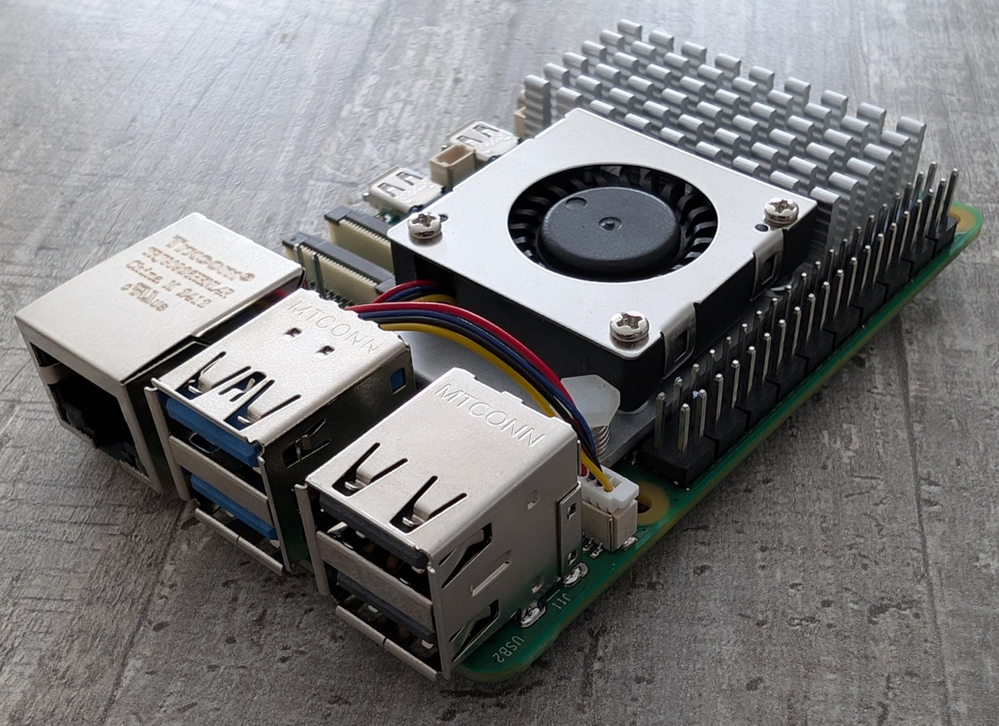
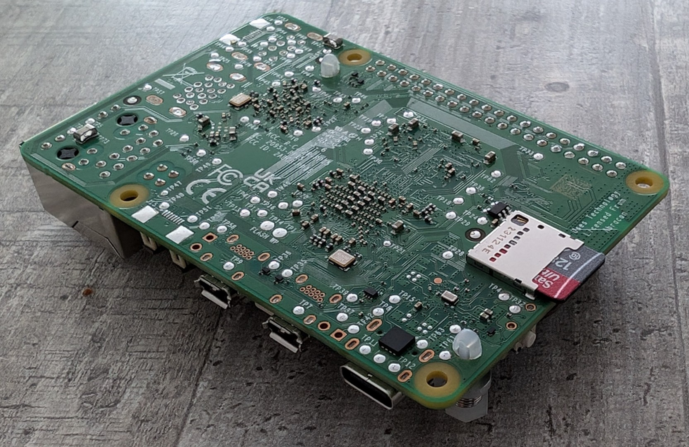
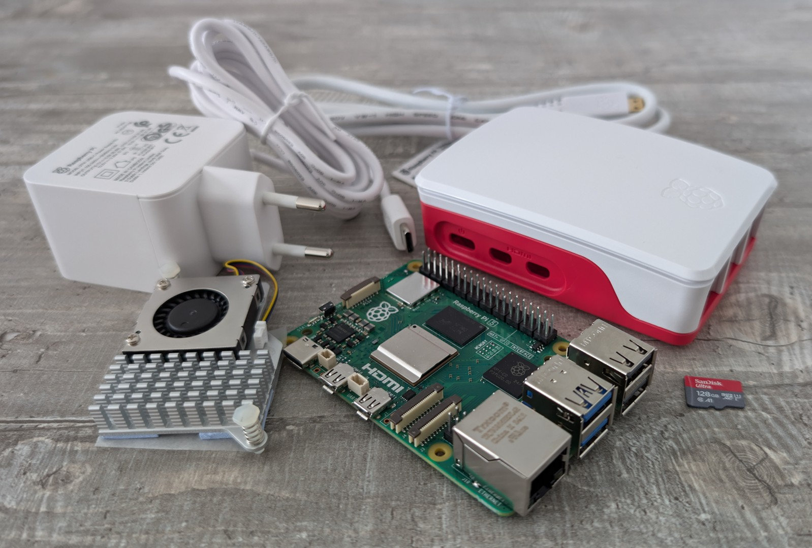
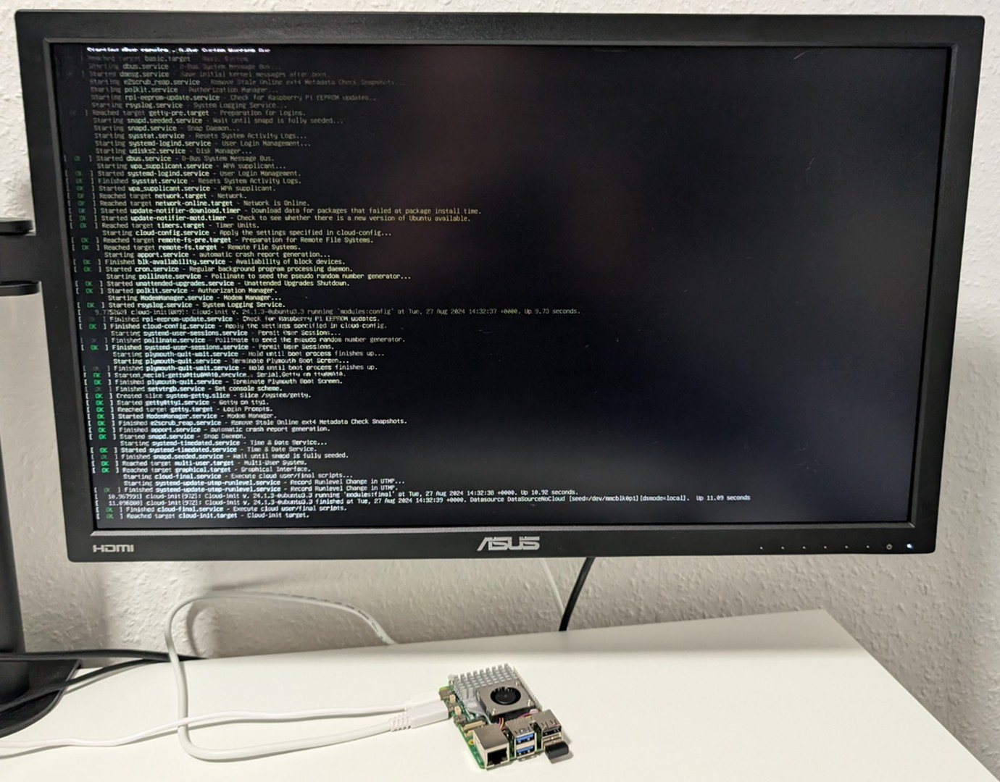
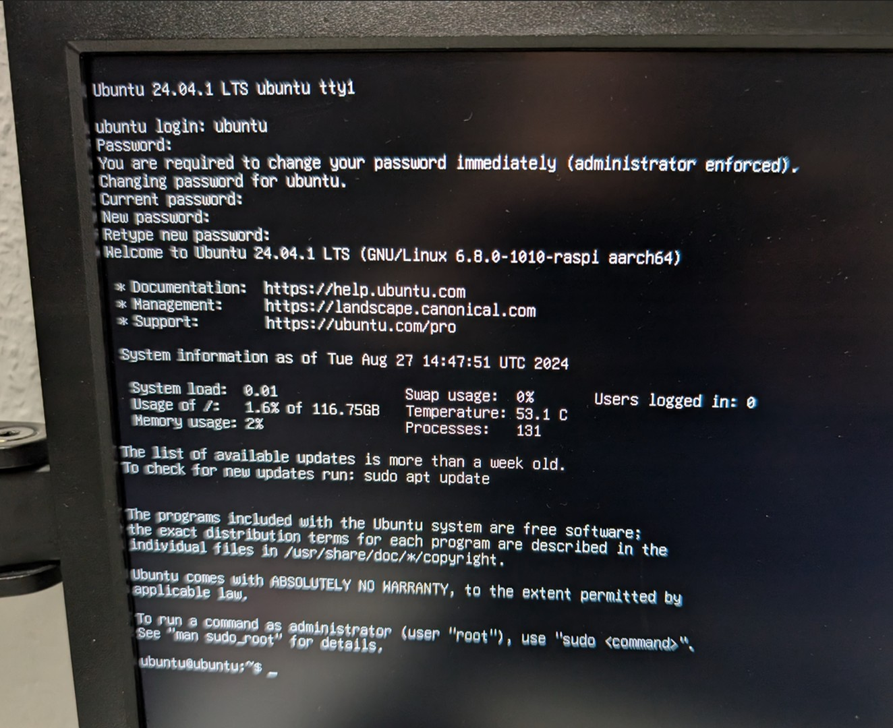

# Installation von Ubuntu Server auf dem Raspberry Pi 5: Eine Schritt-für-Schritt-Anleitung





Der Raspberry Pi 5 ist ein leistungsstarker Einplatinencomputer, der sich hervorragend als Heimserver eignet. In diesem Blogbeitrag zeige ich Ihnen, wie Sie Ubuntu Server auf Ihrem Raspberry Pi 5 installieren können. Folgen Sie dieser detaillierten Anleitung, um Ihren eigenen Ubuntu-Server einzurichten.

## Voraussetzungen

- Raspberry Pi 5
- MicroSD-Karte (mindestens 8 GB, empfohlen 16 GB oder mehr)
- MicroSD-Kartenleser
- Stromversorgung für den Raspberry Pi 5
- Ethernet-Kabel oder WLAN-Verbindung
- Computer zum Schreiben des Images



## Schritt 1: Raspberry Pi Imager herunterladen und installieren

1. Besuchen Sie die offizielle Raspberry Pi-Website: https://www.raspberrypi.org/software/
2. Laden Sie den "Raspberry Pi Imager" für Ihr Betriebssystem herunter.
3. Installieren Sie den Raspberry Pi Imager auf Ihrem Computer.


## Schritt 2: Ubuntu Server Image auf die MicroSD-Karte schreiben

1. Starten Sie den Raspberry Pi Imager.
2. Klicken Sie auf "Choose OS".
3. Scrollen Sie nach unten und wählen Sie "Other general-purpose OS".
4. Wählen Sie "Ubuntu".
5. Wählen Sie "Ubuntu Server" und die neueste Version für den Raspberry Pi aus.
6. Klicken Sie auf "Choose Storage" und wählen Sie Ihre MicroSD-Karte aus.
7. Klicken Sie auf das Zahnrad-Symbol, um erweiterte Optionen zu öffnen:
   - Aktivieren Sie "Set hostname" und geben Sie einen Namen für Ihren Server ein.
   - Aktivieren Sie "Enable SSH" und wählen Sie "Use password authentication".
   - Setzen Sie ein Benutzername und ein sicheres Passwort.
   - Konfigurieren Sie optional Ihre WLAN-Einstellungen, wenn Sie kein Ethernet-Kabel verwenden.
8. Klicken Sie auf "Save" und dann auf "Write", um den Schreibvorgang zu starten.
9. Warten Sie, bis der Vorgang abgeschlossen ist, und entfernen Sie die MicroSD-Karte sicher.

## Schritt 3: Erstmaliges Booten des Raspberry Pi 5

1. Stecken Sie die MicroSD-Karte in den Raspberry Pi 5.
2. Verbinden Sie ein Ethernet-Kabel (falls Sie nicht WLAN konfiguriert haben).
3. Schließen Sie die Stromversorgung an, um den Raspberry Pi 5 zu starten.
4. Warten Sie einige Minuten, bis das System vollständig gebootet ist.



## Schritt 4: Verbindung zum Ubuntu Server herstellen

1. Finden Sie die IP-Adresse Ihres Raspberry Pi 5:

   - Überprüfen Sie die DHCP-Clientliste Ihres Routers oder
   - Verwenden Sie ein Netzwerk-Scan-Tool wie "Advanced IP Scanner" für Windows oder "nmap" für Linux/macOS.
2. Öffnen Sie ein Terminal (auf Windows können Sie PuTTY verwenden) und verbinden Sie sich per SSH:

   ```
   ssh benutzername@<IP-ADRESSE>
   ```

   Ersetzen Sie `<IP-ADRESSE>` durch die tatsächliche IP-Adresse Ihres Raspberry Pi 5 und "benutzername" durch den von Ihnen gewählten Benutzernamen.
3. Akzeptieren Sie den Fingerprint und geben Sie das Passwort ein, das Sie während der Installation festgelegt haben.

## Schritt 5: System aktualisieren und absichern

Nach erfolgreicher Verbindung führen Sie folgende Befehle aus, um Ihr System zu aktualisieren und abzusichern:

```bash
sudo apt update
sudo apt upgrade -y
sudo apt autoremove -y
sudo apt autoclean
```

## Schritt 6: Firewall konfigurieren

Aktivieren und konfigurieren Sie die Firewall:

```bash
sudo ufw allow OpenSSH
sudo ufw enable
```

## Fazit

Glückwunsch! Sie haben erfolgreich Ubuntu Server auf Ihrem Raspberry Pi 5 installiert. Ihr System ist nun einsatzbereit und Sie können beginnen, es nach Ihren Bedürfnissen zu konfigurieren und zu nutzen. Ob als Heimserver, NAS, oder für andere Projekte - Ihr Raspberry Pi 5 mit Ubuntu Server bietet eine solide Grundlage für vielfältige Anwendungen.

Denken Sie daran, Ihr System regelmäßig zu aktualisieren und die Sicherheitseinstellungen an Ihre Bedürfnisse anzupassen. Viel Spaß beim Experimentieren und Lernen mit Ihrem neuen Ubuntu Server auf dem Raspberry Pi 5!


