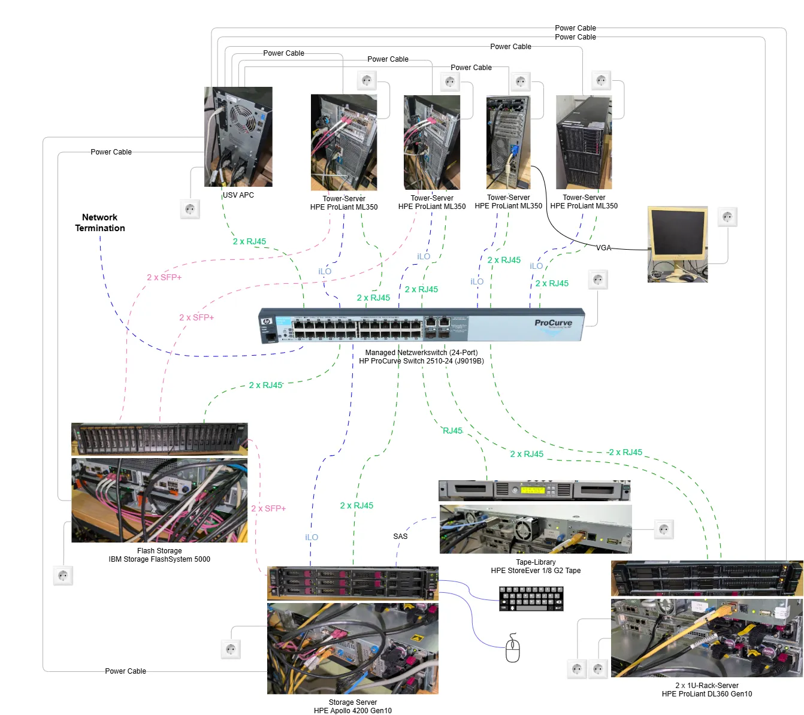

# 🖧 Example Server Infrastructure Setup – A Closer Look

🚀 **Server Room Network Setup Overview – A Practical Example**

In the following, I take a look at an exemplary network setup in a server room. The configuration shows how various servers, storage solutions, and network components are interconnected to form a powerful infrastructure. Each component plays a specific role.

---

🏢 **The Core: HPE ProLiant ML350 Tower Servers (4x)**

These four tower servers are versatile all-rounders. Each is connected to the central switch via **2x RJ45** – standard Ethernet for regular network traffic. Additionally, each server has a connection via **iLO (Integrated Lights-Out)**, a dedicated management interface for remote monitoring and maintenance.

Two of these servers are also directly connected to an **IBM FlashSystem 5000** via **2x SFP+ (10 Gbit/s fiber connection)**. This high-speed link ensures fast access to flash storage, ideal for demanding workloads.

--- 

--- 

🛠️ **The Rack Units: HPE ProLiant DL360 Gen10 (2x)**

Two 1U rack servers connected solely via their **iLO ports**. These are not active in production but are available as **spare systems or for testing**. Nevertheless, they remain visible on the network and can be accessed remotely at any time.

--- 

🌌 **Heavy Storage: HPE Apollo 4200 Gen10**

The storage server is also connected via **2x RJ45** to the network and features its own **iLO port**. An additional **SAS cable (Serial Attached SCSI)** provides a high-speed link typically used to connect storage devices or tape libraries.

Furthermore, the Apollo is directly connected to the **IBM FlashSystem 5000 via 2x SFP+**, ensuring rapid access to high-performance flash data.

---

📊 **Flash Storage: IBM FlashSystem 5000**

This high-performance storage is linked via **2x SFP+** to both the ML350 tower servers and the Apollo 4200. This allows for high-speed data access. It is also connected via **2x RJ45** to the rest of the network for general traffic and management purposes.

--- 

📀 **Tape Library: HPE StoreEver 1/8 G2**

This tape library is used for data backups on magnetic tape. It is connected to the network via **1x RJ45**, sufficient for management and control. Actual data transfer occurs via a **SAS cable** connected directly to the **Apollo 4200**.

--- 

🛡️ **Central Communications: HP ProCurve Switch 2510-24 (J9019B)**

This managed switch is the **central hub** of the network. Everything converges here:

- All servers via RJ45
- IBM FlashSystem 5000 (RJ45)
- StoreEver Tape Library (RJ45)
- APC UPS (RJ45)

The switch is also connected to the **NT (network transition)**, leading to the main building where key VMware services like **vCenter, Active Directory, SQL, Exchange**, and **other applications** are hosted and managed.

--- 

🛣️ **Power Protection: APC UPS**

The uninterruptible power supply is connected via **1x RJ45** to the switch. This connection is used for monitoring – ensuring a timely response in the event of a power failure or other issues.

All six servers, the HPE Apollo, and the IBM FlashSystem 5000 are connected to the power grid and, for safety in case of a power outage, are also connected to the **APC UPS**.

--- 

📽️ **Peripherals**

- A **monitor** is directly connected to one of the ML350 tower servers to allow local management when needed.
- **Keyboard and mouse** are directly attached to the Apollo 4200 server for local administration purposes.

--- 

🔧 **Conclusion: A Thought-Out Example Setup**

This example network demonstrates a solid mix of tower, rack, and storage servers, connected via high-speed links (SFP+, SAS) and standard network ports (RJ45). The infrastructure is scalable, flexible, and easy to manage through dedicated interfaces. At the same time, the tape library and UPS ensure data security and stability.

All components and connections described serve as an **example** of a practical setup in a typical medium-sized data center or server room.

