# Einrichtung einer virtuellen Maschine mit Hyper-V und Remote Desktop-Verbindung

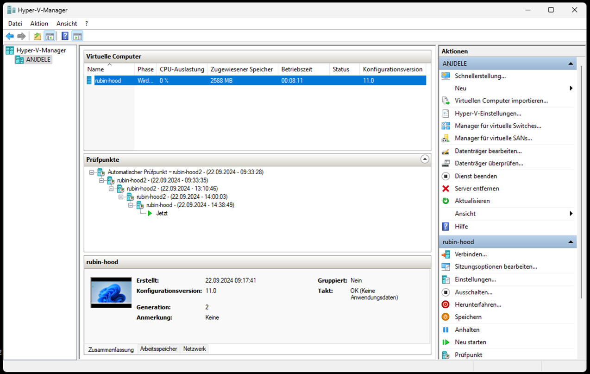

In diesem Blogbeitrag werde ich erklären, wie du eine  **virtuelle Maschine (VM)**  mit  **Hyper-V**  erstellst, darauf  **Windows installierst**  und schließlich eine Verbindung über  **Remote Desktop**  von einem anderen Computer herstellst. Wir gehen Schritt für Schritt durch den Prozess, von der BIOS-Aktivierung bis zur erfolgreichen Remote Desktop-Verbindung.

## Voraussetzungen

- Ein PC mit  **Windows 10 Pro**  oder  **Windows 11 Pro**, auf dem  **Hyper-V**  installiert ist.
- Ein Windows-Installationsabbild (**ISO-Datei**), um Windows in der VM zu installieren.
- Eine funktionierende Netzwerkverbindung zwischen deinem Host-PC (dem Computer, auf dem Hyper-V läuft) und dem Computer, von dem du per Remote Desktop zugreifen möchtest.

## 1. Aktivierung von Hyper-V im BIOS**

Bevor wir mit der Installation beginnen, müssen wir sicherstellen, dass die  **Virtualisierung**  im BIOS deines PCs aktiviert ist. Dazu:

1. **Starte den PC neu**  und rufe das BIOS auf (meist durch Drücken von  **F2**  oder  **Entf**  beim Start).
2. Suche die Option für die  **Virtualisierung**  (meist „Intel VT“ oder „SVM-Modus“ genannt, je nach Prozessor) und stelle sicher, dass sie aktiviert ist.
3. Speichere die Änderungen und starte den PC neu.

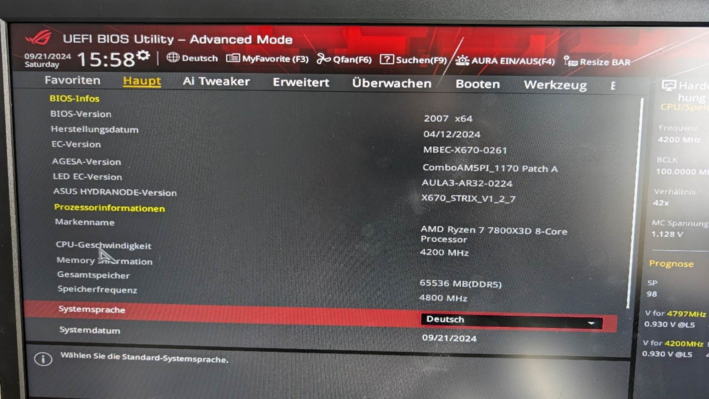

## 2. Hyper-V unter Windows aktivieren

Wenn Hyper-V nicht bereits aktiviert ist, kannst du dies folgendermaßen tun:

Öffne das Startmenü und suche nach Windows-Features aktivieren oder deaktivieren.
Scrolle herunter und aktiviere den Haken bei Hyper-V.
Klicke auf OK und starte den PC neu.

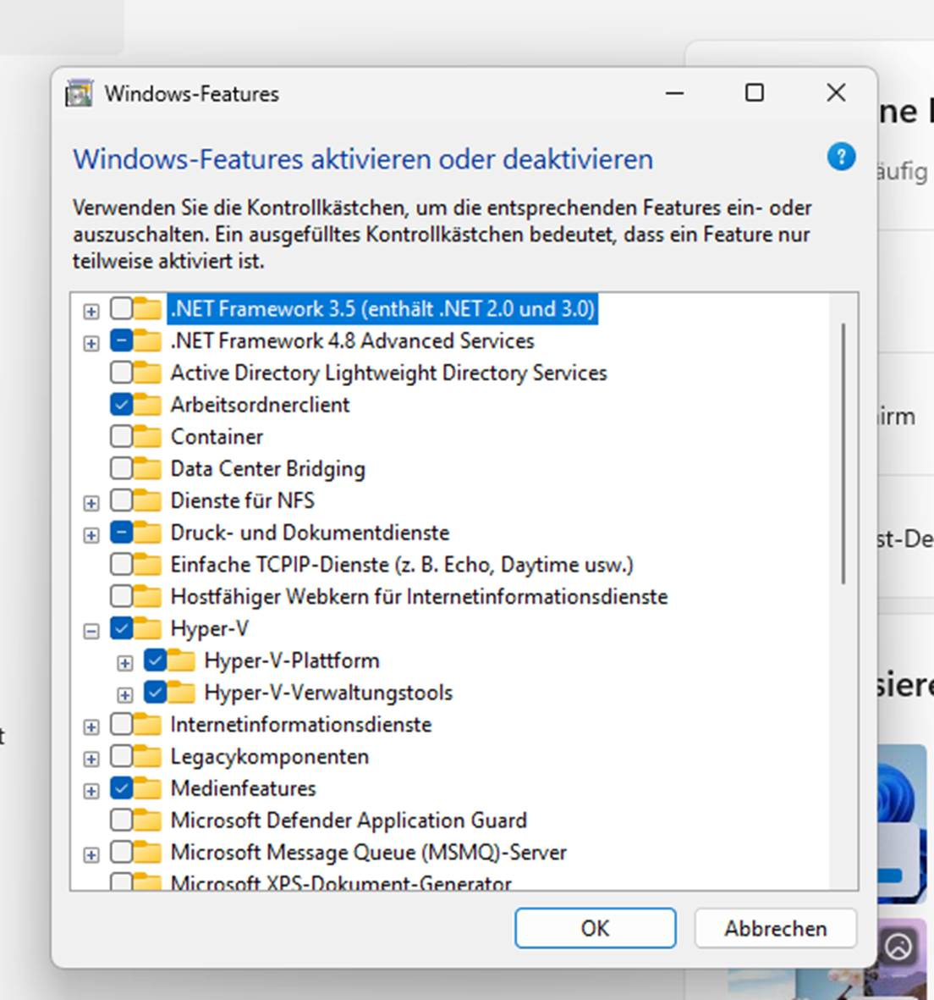

## 3. Erstellen einer virtuellen Maschine**

Nun ist Hyper-V bereit, und wir können eine virtuelle Maschine erstellen.

1. Öffne den  **Hyper-V Manager**  (einfach über die Windows-Suche eingeben).
2. Klicke rechts auf deinen Computernamen und wähle  **Neu**  >  **Virtueller Computer**  aus.
3. Gib der virtuellen Maschine einen Namen (z. B. „Windows 11 VM“) und wähle einen Speicherort für die VM.
4. Wähle als  **Generation**  die  **Generation 2**  aus.
5. Weise der VM genügend  **Arbeitsspeicher (RAM)**  zu (z. B. 4096 MB für ein flüssiges Windows-Erlebnis).
6. Erstelle einen  **virtuellen Switch**  (falls noch nicht vorhanden), um die VM mit dem Netzwerk zu verbinden:

- Gehe zu  **Hyper-V Manager**  >  **Manager für virtuelle Switches**  und erstelle einen  **externen Switch**, der deinen PC mit dem Netzwerk verbindet.

8. Weise der VM mindestens 20 GB  **Speicherplatz**  zu, indem du eine virtuelle Festplatte erstellst.
9. **Installationsmedium auswählen**:

- Wähle die Option „Installationsmedium“ und verweise auf die heruntergeladene  **Windows-ISO-Datei**.

11. Klicke auf  **Fertigstellen**, um die VM zu erstellen.

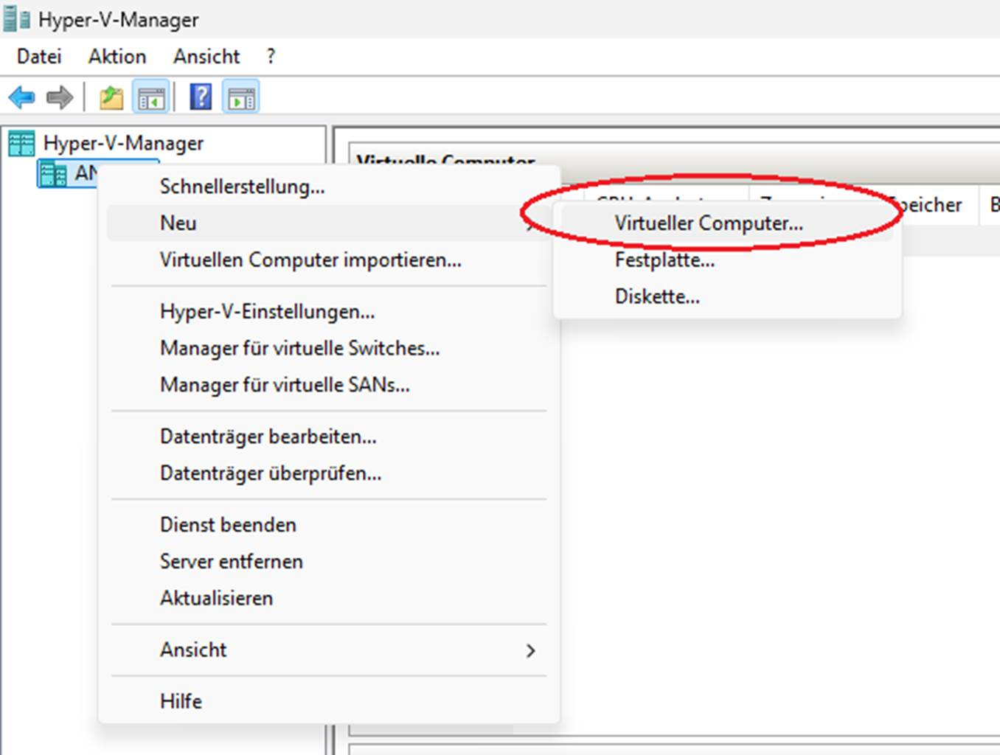

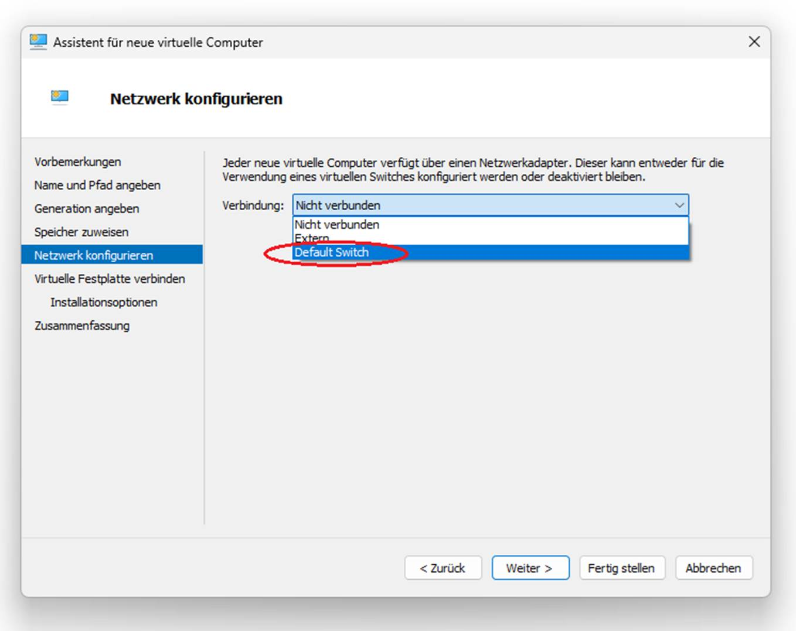
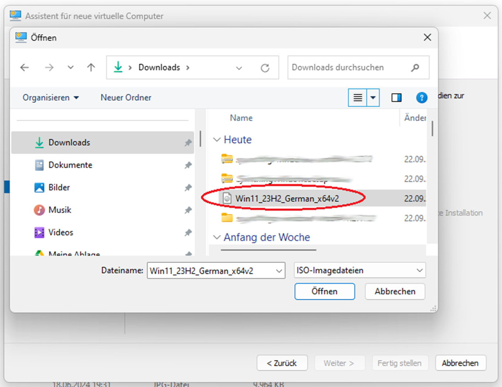
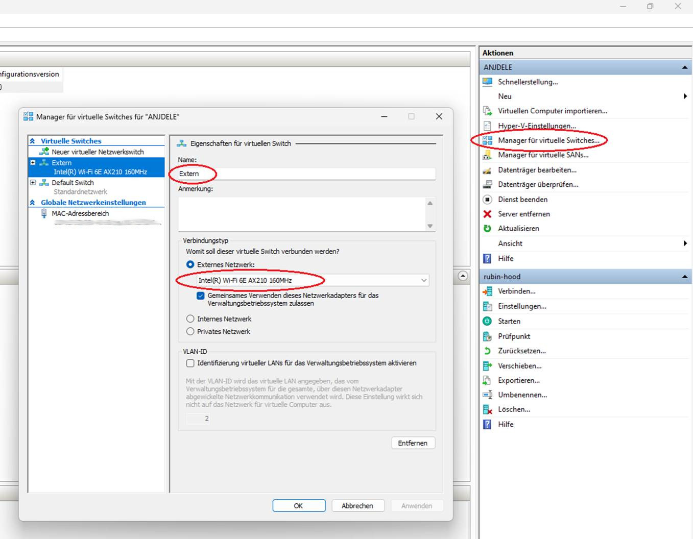

## 4. Windows in der virtuellen Maschine installieren**

Jetzt ist die VM erstellt, und wir können mit der  **Windows-Installation**  fortfahren.

1. Starte die VM, indem du sie im  **Hyper-V Manager**  auswählst und auf  **Verbinden**  klickst.
2. Die VM sollte von der Windows-ISO-Datei booten.
3. Folge den  **Installationsanweisungen**, um Windows wie gewohnt zu installieren (Sprache auswählen, Partition formatieren, etc.).
4. Gib deine  **Windows-Lizenz**  ein (falls vorhanden) oder installiere Windows ohne Lizenzschlüssel.
5. Warte, bis die Installation abgeschlossen ist, und richte dein Konto ein.

## 5. Netzwerkzugriff konfigurieren**

Sobald Windows in der VM installiert ist, solltest du sicherstellen, dass die VM Zugriff auf das Netzwerk hat:

1. Öffne die  **Eingabeaufforderung**  (CMD) in der VM und gib ipconfig ein, um die  **IP-Adresse**  der VM anzuzeigen.

- Die IP-Adresse sollte im Bereich deines lokalen Netzwerks (z. B.  **192.168.x.x**) liegen, wenn du einen externen Switch verwendest.

3. Stelle sicher, dass die VM über den externen Switch mit deinem Netzwerk verbunden ist.

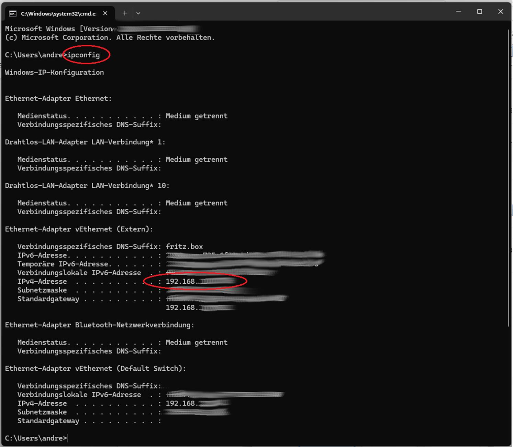

## 6. Remote Desktop in der VM aktivieren**

Nun müssen wir den  **Remotezugriff**  auf die VM aktivieren, damit wir von einem anderen PC darauf zugreifen können.

1. Öffne die  **Einstellungen**  in der VM.
2. Gehe zu  **System**  >  **Remote Desktop**.
3. Aktiviere die Option  **Remote Desktop aktivieren**.
4. Notiere dir die  **IP-Adresse**  der VM, die du später für den Remotezugriff benötigst.

## 7. Firewall-Einstellungen anpassen**

Um sicherzustellen, dass die  **Windows-Firewall**  den Remotezugriff nicht blockiert:

1. Gehe zu  **Windows Defender Firewall**  in der VM.
2. Wähle  **App durch Firewall zulassen**  und stelle sicher, dass  **Remote Desktop**  aktiviert ist (sowohl für private als auch für öffentliche Netzwerke).

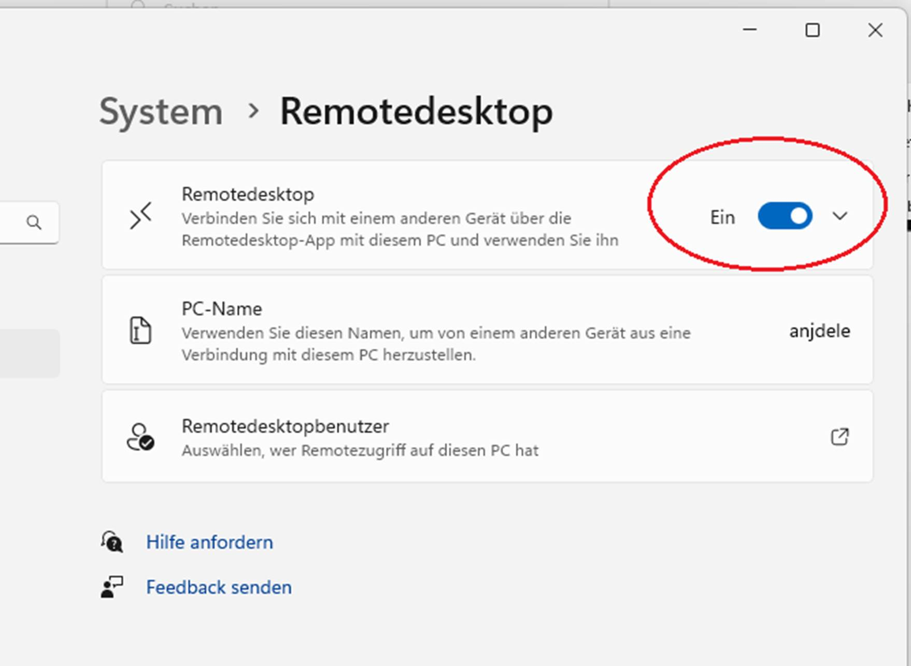
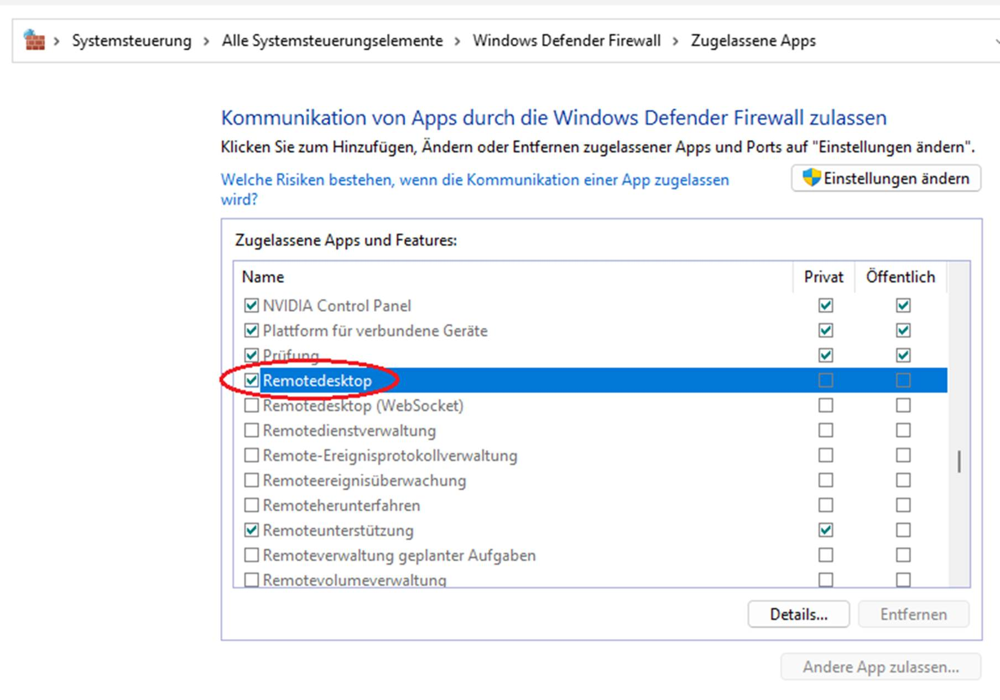
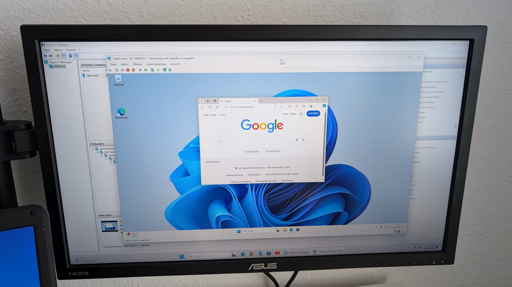

## 8. Verbindung über Remote Desktop herstellen**

Nun kannst du von einem anderen Computer aus per  **Remote Desktop**  auf die VM zugreifen:

1. Öffne auf einem anderen PC den  **Remote Desktop Client**  (drücke  **Windows + R**, gib mstsc ein und drücke  **Enter**).
2. Gib die  **IP-Adresse der VM**  ein (z. B.  **192.168.178.x**).
3. Gib die  **Anmeldeinformationen**  der VM ein (Benutzername im Format PC-Name\Benutzername und das Passwort).
4. Klicke auf  **Verbinden**.

Wenn alles richtig konfiguriert ist, solltest du nun Zugriff auf die VM haben und sie wie einen normalen PC verwenden können!

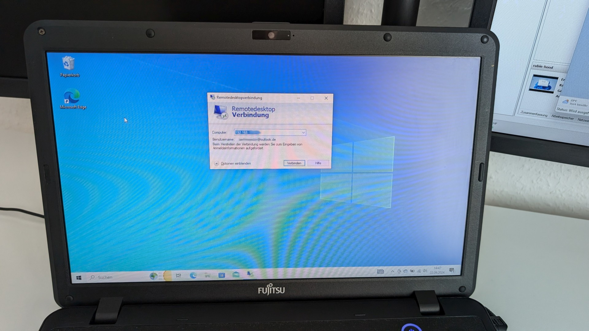
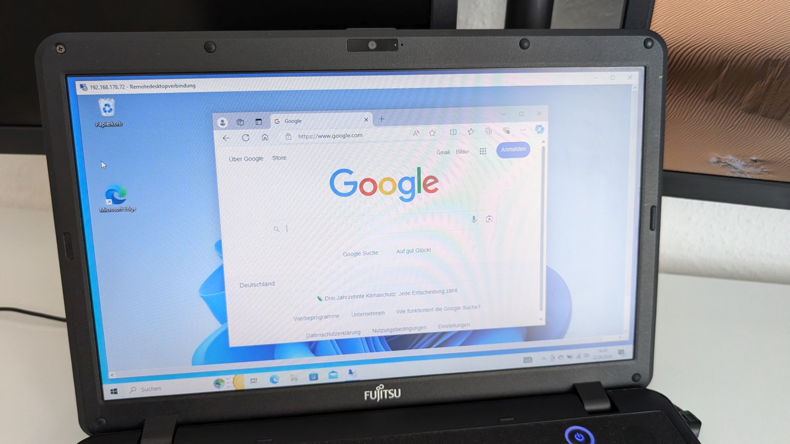

Die Erstellung einer virtuellen Maschine mit  **Hyper-V**  und der Zugriff per  **Remote Desktop**  ist eine großartige Möglichkeit, um virtuelle Umgebungen zu testen und zu nutzen. Mit diesen Schritten kannst du sicherstellen, dass die VM korrekt eingerichtet ist und du von überall in deinem Netzwerk darauf zugreifen kannst.

Falls du auf Probleme stößt, überprüfe die Netzwerkeinstellungen und stelle sicher, dass der Remotezugriff korrekt aktiviert ist.
